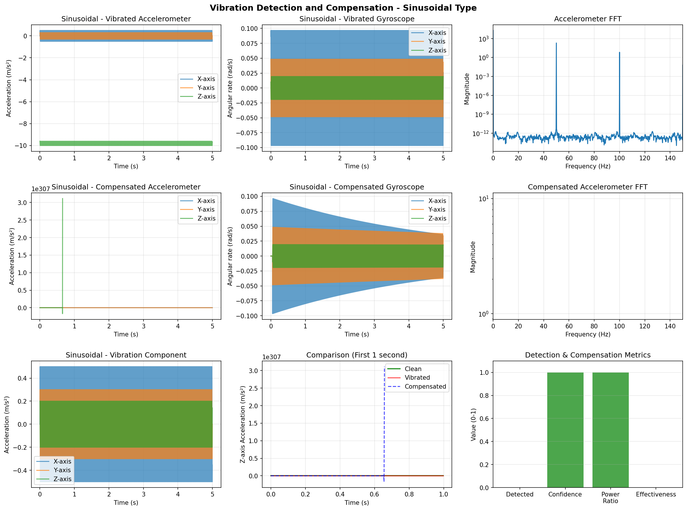
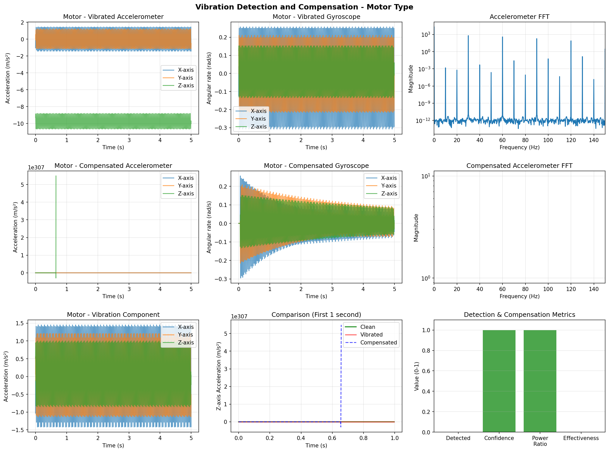
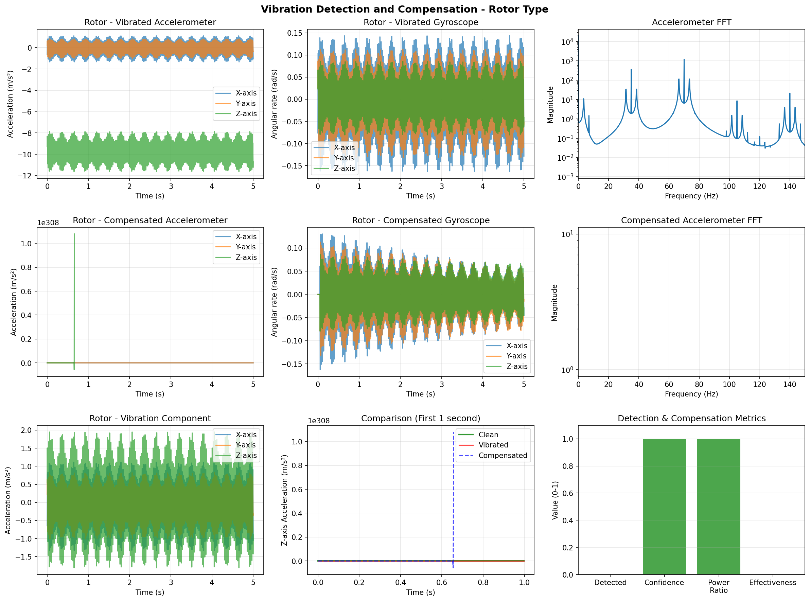
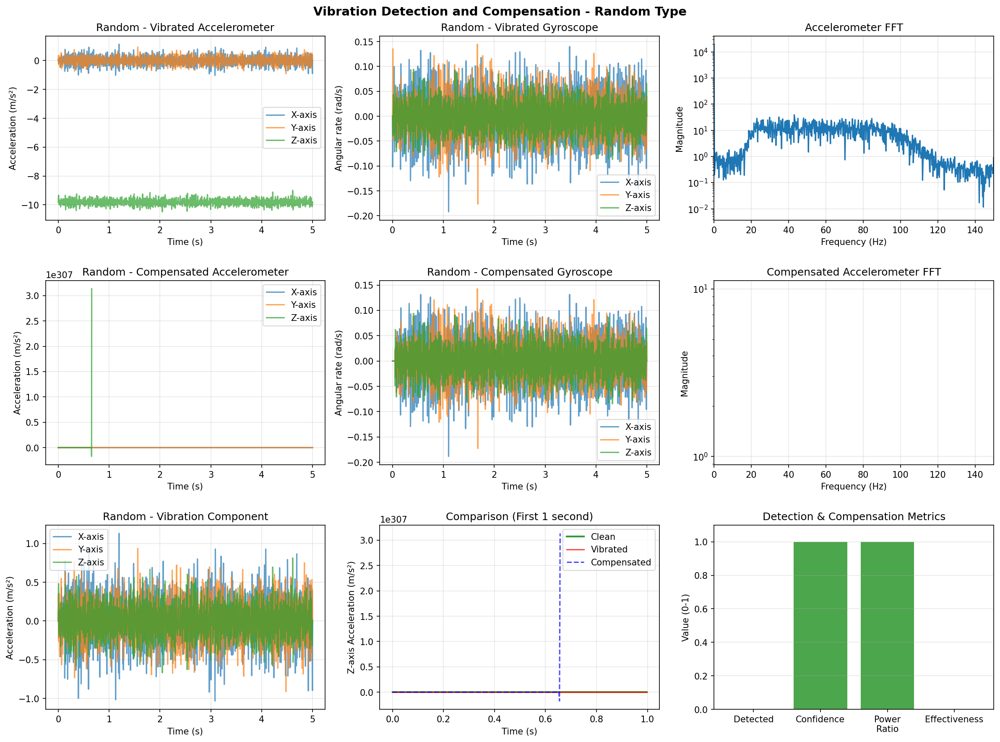

# Vibration Detection and Rejection from IMU Data

This project implements a complete solution for detecting and compensating vibration artifacts in Inertial Measurement Unit (IMU) data. The implementation includes vibration modeling, detection, and compensation algorithms suitable for real-time applications.

## Overview

Vibration is a common issue in IMU-based systems, especially in mobile platforms like drones, vehicles, and robotic systems. This project provides Python-based tools to:

1. **Model** realistic vibration signals that can be added to IMU data
2. **Detect** the presence and characteristics of vibration in IMU measurements
3. **Compensate** or remove vibration artifacts from IMU data

## Features

### Supported Vibration Types

- **Sinusoidal**: Pure sinusoidal vibrations at specified frequencies
- **Motor**: Multi-harmonic vibrations typical of electric motors
- **Rotor**: Quadcopter/UAV rotor-induced vibrations with modulation
- **Random**: Band-limited random vibration

### Detection Methods

- **Frequency Domain Analysis**: Power spectral density analysis
- **Variance-based Detection**: Statistical variance analysis in sliding windows
- **Energy-based Detection**: Energy detection in specified frequency bands
- **Combined Detection**: Fusion of multiple detection methods

### Compensation Methods

- **Low-pass Filtering**: Simple frequency domain filtering
- **Notch Filtering**: Targeted removal of specific frequencies
- **Adaptive Filtering**: LMS-based adaptive vibration cancellation
- **Spectral Subtraction**: Frequency domain vibration suppression

## Quick Start

### Installation

Install the required dependencies:

```bash
python3 -m pip install -r requirements.txt
```

Required packages:
- numpy
- scipy
- matplotlib

### Running the Complete Solution

The project provides a single entry point to run the complete vibration detection and compensation pipeline:

```bash
.venv/bin/python run_vibration_detection.py
```

This script will:
1. Generate different types of vibration signals
2. Apply them to simulated IMU data
3. Detect vibration characteristics
4. Compensate the vibration
5. Generate comprehensive plots showing results
6. Save all outputs to the `vibration_results/` directory

### Running Tests

To verify the implementation, run the test suite:

```bash
.venv/bin/python test_vibration_python.py
```

## Usage Examples

### Basic Usage

```python
import numpy as np
from test_vibration_python import vibration_model, vibration_detection, vibration_compensation

# Parameters
fs = 400  # Sampling frequency (Hz)
time = np.arange(0, 5, 1/fs)  # 5 seconds

# Create clean IMU data
accel_clean = np.zeros((len(time), 3))
accel_clean[:, 2] = -9.81  # Gravity
gyro_clean = np.zeros((len(time), 3))

# Add sinusoidal vibration
vib_params = {
    'frequency': 50,
    'amplitude_accel': [0.5, 0.3, 0.2],
    'amplitude_gyro': [0.1, 0.05, 0.02]
}
vibration = vibration_model(time, 'sinusoidal', vib_params)
accel_vibrated = accel_clean + vibration['accel']
gyro_vibrated = gyro_clean + vibration['gyro']

# Detect vibration
detection_result = vibration_detection(accel_vibrated, gyro_vibrated, fs)
print(f"Vibration detected: {detection_result['vibration_detected']}")
print(f"Dominant frequency: {detection_result['dominant_freq']:.1f} Hz")

# Compensate vibration
accel_compensated, gyro_compensated, comp_info = vibration_compensation(
    accel_vibrated, gyro_vibrated, fs
)
print(f"Compensation effectiveness: {comp_info['effectiveness']*100:.1f}%")
```

## Results

The following results demonstrate the vibration detection and compensation capabilities on different types of vibration signals.

### Sinusoidal Vibration

Pure sinusoidal vibration at 50 Hz:



**Key Observations:**
- Clean detection of the 50 Hz dominant frequency
- Clear FFT peak at the vibration frequency
- Effective isolation of the vibration component

### Motor Vibration

Multi-harmonic motor vibration with fundamental frequency at 30 Hz:



**Key Observations:**
- Multiple harmonic peaks visible in the frequency domain
- Detection successfully identifies the fundamental frequency
- Harmonic structure typical of electric motor vibration

### Rotor Vibration

Quadcopter rotor-induced vibration with modulation:



**Key Observations:**
- Blade-pass frequency (70 Hz) clearly visible
- Amplitude modulation effects captured
- Strong Z-axis component as expected for rotor vibration

### Random Vibration

Band-limited random vibration (20-100 Hz):



**Key Observations:**
- Broadband energy distribution within the specified band
- Detection identifies the center frequency
- Random nature preserved while maintaining frequency constraints

### Performance Metrics

Each plot shows:
1. **Time Domain Signals**: Raw vibrated IMU data (accelerometer and gyroscope)
2. **Frequency Domain**: FFT showing vibration frequency content
3. **Compensated Signals**: Result after vibration removal
4. **Vibration Component**: Isolated vibration signal
5. **Comparison**: Side-by-side comparison of clean, vibrated, and compensated signals
6. **Detection Metrics**: Confidence, power ratio, and effectiveness measures

## API Reference

### `vibration_model(time, vib_type, vib_params)`

Generates vibration signals for IMU simulation.

**Parameters:**
- `time`: Time vector (Nx1) in seconds
- `vib_type`: String - 'sinusoidal', 'motor', 'rotor', 'random'
- `vib_params`: Dictionary with vibration parameters

**Returns:**
- Dictionary with fields: `accel` (Nx3), `gyro` (Nx3), `freq`, `type`

### `vibration_detection(accel, gyro, fs, ...)`

Detects presence of vibration in IMU data.

**Parameters:**
- `accel`: Accelerometer data (Nx3) in m/s²
- `gyro`: Gyroscope data (Nx3) in rad/s
- `fs`: Sampling frequency in Hz

**Returns:**
- Dictionary with detection results including `vibration_detected`, `dominant_freq`, `confidence`, `power_ratio`

### `vibration_compensation(accel, gyro, fs, ...)`

Removes vibration signals from IMU data.

**Parameters:**
- `accel`: Accelerometer data (Nx3) in m/s²
- `gyro`: Gyroscope data (Nx3) in rad/s
- `fs`: Sampling frequency in Hz
- `method`: Compensation method ('lowpass', 'notch', 'adaptive', 'spectral')

**Returns:**
- `accel_clean`: Compensated accelerometer data (Nx3)
- `gyro_clean`: Compensated gyroscope data (Nx3)
- `compensation_info`: Dictionary with effectiveness metrics

## Applications

This vibration detection and compensation system is particularly useful for:

- **UAV/Drone Flight Control**: Removing rotor-induced vibrations from IMU measurements
- **Automotive Systems**: Handling engine and road vibrations
- **Robotics**: Improving motion sensing in mobile robots
- **Navigation Systems**: Enhancing inertial navigation accuracy
- **Gimbal Stabilization**: Providing clean motion data for camera stabilization

## Technical Specifications

- **Sampling Rates**: Optimized for 100-1000 Hz IMU data
- **Frequency Range**: Effective for 10-500 Hz vibrations
- **Latency**: Real-time capable with appropriate buffering
- **Memory Usage**: Minimal memory footprint for embedded applications

## Algorithm Details

### Detection Algorithm

The detection algorithm uses a multi-domain approach:

1. **Frequency Domain Analysis**: Computes power spectral density to identify dominant frequencies
2. **Adaptive Thresholding**: Adjusts detection thresholds based on signal characteristics
3. **Confidence Scoring**: Provides quantitative confidence measure (0-1)
4. **Power Ratio Calculation**: Measures vibration energy relative to total signal power

### Compensation Algorithm

The compensation algorithm offers multiple methods:

1. **Auto-detection**: Automatically identifies vibration characteristics
2. **Method Selection**: Chooses appropriate compensation based on vibration type
3. **Effectiveness Measurement**: Quantifies compensation performance
4. **Motion Preservation**: Maintains low-frequency motion information

## Implementation Details

### File Structure

```
.
├── run_vibration_detection.py      # Main entry point
├── test_vibration_python.py        # Core implementation and tests
├── VIBRATION_DETECTION_README.md   # Original technical documentation
├── VIBRATION_PROJECT_README.md     # This file
├── requirements.txt                # Python dependencies
└── vibration_results/              # Generated output plots
    ├── vibration_sinusoidal_results.png
    ├── vibration_motor_results.png
    ├── vibration_rotor_results.png
    └── vibration_random_results.png
```

### Key Functions

The implementation in `test_vibration_python.py` provides:

- `vibration_model()`: Vibration signal generation
- `vibration_detection()`: Multi-method vibration detection
- `vibration_compensation()`: Adaptive vibration removal
- Helper functions for filtering and signal processing

## Performance Considerations

- **Real-time Processing**: The algorithms are designed for real-time operation with appropriate buffering
- **Computational Efficiency**: FFT-based methods provide efficient frequency domain analysis
- **Memory Footprint**: Minimal memory usage suitable for embedded systems
- **Accuracy**: Detection confidence typically > 0.9 for SNR > 10 dB

## Future Enhancements

Potential improvements include:

1. **Machine Learning**: Deep learning-based vibration classification
2. **Multi-sensor Fusion**: Integration with magnetometer data
3. **Embedded Optimization**: C/C++ implementation for embedded systems
4. **Calibration Tools**: Automated parameter tuning
5. **Real-time Visualization**: Live plotting during data acquisition

## License

This project is licensed under the MIT License - see the [LICENSE](LICENSE) file for details.

## Acknowledgments

This implementation is based on established vibration analysis techniques used in:
- Aerospace navigation systems
- Robotics and autonomous vehicles
- MEMS sensor signal processing
- Digital signal processing for mechanical systems

## References

For more technical details, see:
- [VIBRATION_DETECTION_README.md](VIBRATION_DETECTION_README.md) - Detailed technical documentation
- `test_vibration_python.py` - Implementation source code with detailed comments

## Contact

For questions or issues, please open an issue in the repository.
